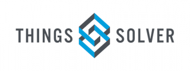
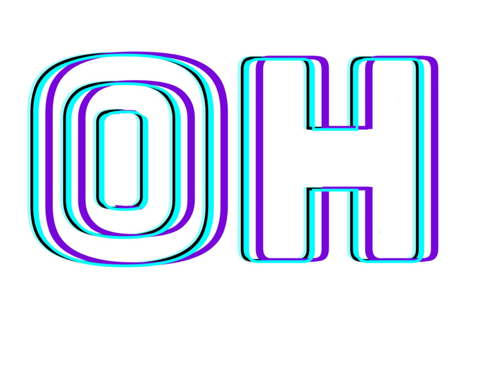

---
header:
  caption: ""
  image: ""
layout: docs
title: Partners
---

 

<b><h3> By supporting our organization, you contribute to building diversity and inclusion in data driven working environment ecosystem.</h3></b>

We welcome and invite organisations and individuals to contribute in our quest in seeking to address the bias and the gender disparity in data driven working environments
by offering space, fostering collaborations with data owners and industry, mentoring, facilitating events, investments and more. If you
<ul>
  <li> are seeking an innovative partner for a long-term program</li>
  <li> have laptops, time or something else to donate</li>
  <li> are thinking of hiring one of our qualifier</li> 
</ul>
then, get in touch to discuss how together we can empower women and gender minorities in DS and AI.
 
 
 

<a href="https://sisanalyst.netlify.app/donate">
<button class="button button2">Donate!</button>
</a>

 

 

<b><h3>  We Need Your Support Today!</h3></b>

 
 
<!DOCTYPE html>
<html>
<title>W3.CSS</title>
<meta name="viewport" content="width=device-width, initial-scale=1">
<link rel="stylesheet" href="https://www.w3schools.com/w3css/4/w3.css">
<body>
  

    

      
    

    

      
    

    

      
    

  

  

    

      
    

    

      
    

    

      
    

  

</body>
</html>

</html>

